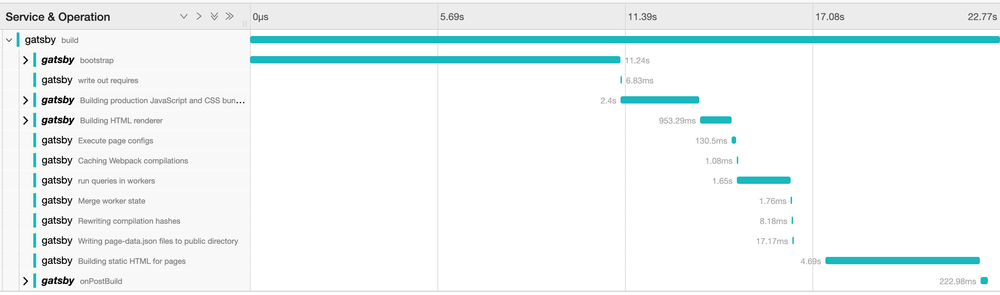
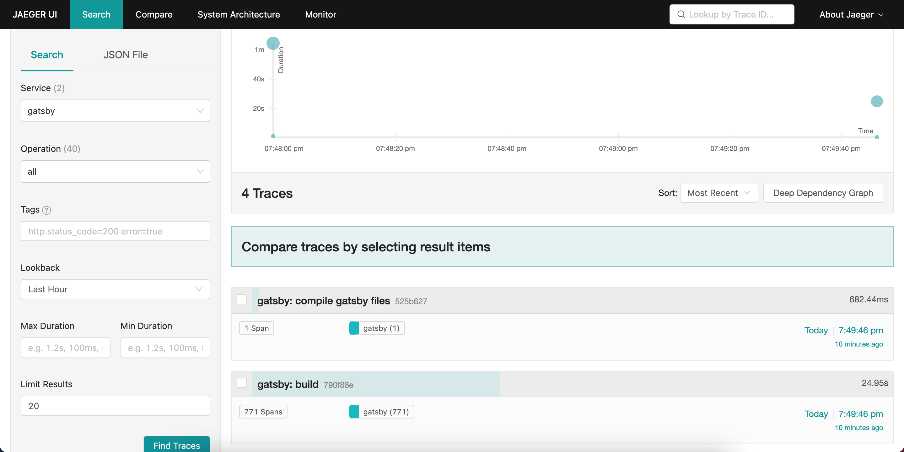

# Lets trace Gatsby

_Author: Taras Rodynenko (t.rodynenko@gmail.com)_

Gatsby is one of most known SSG frameworks nowadays, and you can find a lot of guides how to configure your project for your needs. Gatsby team and commutiny spend time to make Gatsby builds performant and optimal. But sometime your own configurations can shot in your feet, and you need to find where is the bottleneck and why builds are so long. In this articles we are going to setup solution that can help you to look inside your builds. We are going to talk about tracing.

## What is Tracing?

[Tracing](https://en.wikipedia.org/wiki/Tracing_(software)) is the process that provides developers with information useful for debugging. It sounds very closer to logging, isn't it? Yeah, it is, and there is no clear difference between tracing and logging, everything is in details. Here when we are talking about Gatsby tracing, we mean getting information about internal Gatsby processes and their parts that happens during the build.



Some of information we already get from build logs, like 

```Page build state was successful: 8.6s``` 

Logs help us to understand progress and timing information. Unfortunately, there is no clear way to see and compare those values in dynamic, or look deeper (closer to child processes). When it comes to performance investigation, it is good to have opportunity to separate more detailed data from common log flow. And we have a tool - turn on [performance tracing for Gatsby builds](https://www.gatsbyjs.com/docs/performance-tracing/)

## Collecting traces

We can find out from Gatsby documentation that there are several tracing formats that are used to share information:

* [OpenTracing](https://opentracing.io/). Deprecated, but Gatsby is using it internally
* [OpenTelemetry](https://opentelemetry.io/). Merger of the OpenTracing and [OpenCensus](https://opencensus.io/) projects. There is a shim from OpenTracing to OpenTelemetry.

We will use OpenTelemetry in our example, but first lets provide some useful definitions for building blocks from OpenTeletry documentations:

* [Span](https://opentelemetry.io/docs/concepts/signals/traces/#spans-in-opentelemetry) represents a unit of work or operation (like method or plugin call). Spans are the building blocks of Traces.
* [Traces](https://opentelemetry.io/docs/concepts/observability-primer/#distributed-traces), or Distributed Traces, records the paths taken by requests as they propagate through multi-service architectures, like microservice and serverless applications. 

In our case we collect trace (called `build`, because we will call `gatsby build` command) and its spans that are generated by Gatsby.

## Test project

In order to make some test runs, we need Gatsby project with configuration for tracing. For simplicity, lets use default `gatsby-starter-blog` as a start (you can find installed default project in `./gatsby-starter-blog-example`):

```bash
npx gatsby new gatsby-starter-blog https://github.com/gatsbyjs/gatsby-starter-blog
```

### Trace collector
[Trace collector](https://opentelemetry.io/docs/concepts/components/#collector) is the service that can receive, process, and export telemetry data. For our example we also need some collector service to receive traces and visualize them.

There are lot of open source solutions (like Jeager, Zipkin, OTLP, AWS Distro) and commercial ones (like Dynatrace).

For simlicity we are going to use [Jaeger](https://www.jaegertracing.io/) for our local needs. To start the service locally we can copy [docker command from Gatsby docs](https://www.gatsbyjs.com/docs/performance-tracing/#local-jaeger-with-docker), just update version of docker image :
```bash
docker run -d --name jaeger \
    -e COLLECTOR_ZIPKIN_HTTP_PORT=9411 \
    -p 5775:5775/udp \
    -p 6831:6831/udp \
    -p 6832:6832/udp \
    -p 5778:5778 \
    -p 16686:16686 \
    -p 14268:14268 \
    -p 9411:9411 \
    jaegertracing/all-in-one:latest
```
and now Jaeger should be available on `http://localhost:16686`



### Tracing configuration

Get back for colecting tracing. We will configurate build traces in file `tracing.js`. Gatsby APIs require us to provide two mandatory methods `create` and `stop` to be exported.

```js
exports.create = () => {
  // return tracer which Gatsby will use to create spans
}
exports.stop = async () => {
  // stopping collecting traces
}
```

Next step is to setup OpenTelementry environment.

First, add dependancies for opentelemetry and Jaeger's exporter:
```bash
yarn add @opentelemetry/exporter-jaeger @opentelemetry/resources @opentelemetry/sdk-trace-node @opentelemetry/semantic-conventions @opentelemetry/shim-opentracing
```

> In this example we are going to create Tracer manually (mostly synchronical code). Opentelemetry documentation proposes to use use Opentelemetry SDK instead (it is Promise-based), but there is an [example with SDK](./gatsby-starter-blog-example/tracing-sdk.js) too. Use of SDK wraps up all internal configurations, and hide some logic into global variables/context, and it requires executing / intializing tracing before main code call.

### Some piece of code

Before we begin digging into configurations, there is already all together as [a final code](./gatsby-starter-blog-example/tracing.js).

First lets import what we need later. We will explain meanings closer to the place of use.
```js
const { TracerShim } = require('@opentelemetry/shim-opentracing')
const { AlwaysOnSampler, W3CTraceContextPropagator } = require('@opentelemetry/core')
const { NodeTracerProvider } = require('@opentelemetry/sdk-trace-node')
const { BatchSpanProcessor } = require('@opentelemetry/sdk-trace-base')
const { SemanticResourceAttributes } = require('@opentelemetry/semantic-conventions')
const { Resource } = require('@opentelemetry/resources')
const { JaegerExporter } = require('@opentelemetry/exporter-jaeger')
```

#### Sampler

[Sampler](https://opentelemetry.io/docs/instrumentation/go/exporting_data/#sampling) is responsible for filtering Spans which should be counted and pushed forward to the consuming service (in OpenTelemtry this service ofter is called `backend`). 

There are two build-in samplers: `AlwaysOn` (allow all spans, default one) and `AlwaysOff` (disallow all spans). In our case, we want to get all possible information, even it is very detailed. You can always have your custom Sampler, for example to remove spans/information about your external plugins.
```js
const sampler = new AlwaysOnSampler()
```

#### Resources

[Resources](https://opentelemetry.io/docs/reference/specification/resource/sdk/) defines immutable attributes (properties) which are set to all spans and traces associated with the tracing service where they was used in setup.

There is a [list of standard attributes](https://opentelemetry.io/docs/reference/specification/resource/semantic_conventions/) where some default values are defined.

There is no requirements for setting Resources, except `service_name`, that helps to differenciate different information services on monitoring or visualizing service (Collector).

When using SDK setup, OpenTelemetry also autimatically adds [some properties](https://github.com/open-telemetry/opentelemetry-js/blob/main/packages/opentelemetry-resources/src/detectors/ProcessDetector.ts#L33) from `process`, and [some properties from environment variable `OTEL_RESOURCE_ATTRIBUTES`](https://github.com/open-telemetry/opentelemetry-js/blob/main/packages/opentelemetry-resources/src/detectors/EnvDetector.ts#L49)
```js
const resource = new Resource({
  [SemanticResourceAttributes.SERVICE_NAME]: `gatsby`,
  [SemanticResourceAttributes.SERVICE_VERSION]: `1.0.0`
})
```

#### Exporter

[Exporter](https://opentelemetry.io/docs/instrumentation/js/exporters/) provides opportunity to export traces to the chosen service (collector, like Jaeger, Dynatrace etc)

In our example we are going to use Jaeger's one.

```js
const exporter = new JaegerExporter({
  endpoint: `http://localhost:14268/api/traces`
})
```

#### Span processor

SpanProcessor setups how Spans will be sent to the consuming service through Exporter.

There are two basic options:
  1. Batching (grouping together in one request, default value in SDK solution)
  2. Simple (send one by one)

It is recommended to group spans to reduce impact on consuming service (like Jaeger server)
```js
const spanProcessor = new BatchSpanProcessor(exporter)
```

#### Context manager and propagator

OpenTelemetry has [Context](https://github.com/open-telemetry/opentelemetry-js-api/blob/main/docs/context.md) mechanism that provides opportunity to store and propagate important telemetry data between traces and nested spans (for example child-parent connection). Context manager and propagator are parts of this context sharing process.

[ContextManager](https://github.com/open-telemetry/opentelemetry-js-api/blob/main/docs/context.md#context-manager) is responsible for storing and providing access to the context value.

[Propagator](https://opentelemetry.io/docs/reference/specification/overview/#propagators) is using to define the method of serialize and deserialize context values, and transportation method. You can also read much more about [Propagator API](https://github.com/open-telemetry/opentelemetry-specification/blob/v1.6.0/specification/context/api-propagators.md) itself. 

In our example, we will use default ContextManager (based on [AsyncLocalStorage](https://nodejs.org/api/async_context.html#async_context_class_asynclocalstorage)) and Propagator proposed in OpenTelemetry SDK that is based on [W3C trace context specification](https://www.w3.org/TR/trace-context/), in short words, it uses similar logic to HTTP headers that provides context - [W3CTraceContextPropagator](https://github.com/open-telemetry/opentelemetry-js/blob/3cca2cec8f4e45b4de2f8f4fd0b10d32627f1c63/packages/opentelemetry-core/src/trace/W3CTraceContextPropagator.ts).

```js
const contextManager = undefined
const propagator = new W3CTraceContextPropagator()
```

#### Tracer provider

[TraceProvider](https://opentelemetry.io/docs/reference/specification/trace/api/#tracerprovider) mixes all configurations together, and provide the Tracer instance

```js
const tracerProvider = new NodeTracerProvider({
  sampler,
  resource
})

// Add span processor
tracerProvider.addSpanProcessor(spanProcessor)
// Turn on tracer provider
tracerProvider.register({
  contextManager,
  propagator
})
```

#### Instrumentation (optional)

[Intrumentation](https://opentelemetry.io/docs/concepts/instrumenting/) configurates libraries to provide information in OpenTelementry format. In short, it wraps core functionalities to create traces and spans. For example if you want to collect information about node js or express internal calls. library [`@opentelemetry/auto-instrumentations-node`](https://www.npmjs.com/package/@opentelemetry/auto-instrumentations-node#supported-instrumentations) includes instrumentations for many different libraries and environments like Express, Koa, Restify, Fastify, AWS Lambda etc

For our example, we do not need to collect information about outer environment, so instrumentation part is commented out in example code.

```js
const { registerInstrumentations } = require('@opentelemetry/instrumentation')
const { getNodeAutoInstrumentations } = require('@opentelemetry/auto-instrumentations-node')

/*
 ... other tracing setup 
 */

registerInstrumentations({
  instrumentations: [
    getNodeAutoInstrumentations(),
  ],
  tracerProvider: tracerProvider
})
```

#### Connecting to Gatsby

On the last step, we need to provide tracer from TracerProvider by OpenTracing shim to Gatsby.

```js
exports.create = () => {
  // get tracer and pass it to Gatsby through shim
  const tracer = tracerProvider.getTracer(`gatsby-tracer`)
  return new TracerShim(tracer)
}

exports.stop = async () => {
  await tracerProvider.shutdown()
}
```

### Final setup 
Now when we have provided all tracing configurations to Gatsby we can finally send our build traces 🙌

We have two options to do that: 
1. in case of use `sdk` libraries (because they are use asyncrinical setup for OpenTelementry API). See [`tracing-sdk.js`](./gatsby-starter-blog-example/tracing-sdk.js)
```bash
GATSBY_OPEN_TRACING_CONFIG_FILE=tracing-sdk.js node -r ./tracing-sdk.js node_modules/gatsby/cli.js build
```
2. More simpler way, but it require us to have syncronical code as in [`tracing.js`](./gatsby-starter-blog-example/tracing.js) to setup OpenTelementry API
```bash
gatsby build --open-tracing-config-file ./tracing.js
```

Now you should see several traces in Jaeger interface. Trace, called `build`, is main one and includes spans from internal Gatsby processes.

||
|:--:|
| Jaeger interface with `build` trace |

## Summary

Tracing gives us real opportunity to look a little under the hood of Gatsby build process, and to have prepared data for monitoring and analyzing. Unfortunately, Gatsby tracing is not suitable to understand errors. You will not only get some part of batches of Spans, if there is any error. 🤷‍♂️

### Something to read more

1. [OpenTelemetry Sampling: Everything You Need to Know](https://www.aspecto.io/blog/opentelemetry-sampling-everything-you-need-to-know/)
2. [OpenTelemetry JavaScript Client (Github)](https://github.com/open-telemetry/opentelemetry-js) includes most packages used in example
